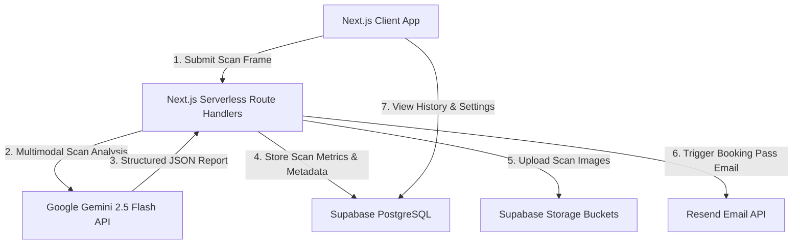

# Product Requirements & Implementation Document (PRD)
**Project Name:** WBH Skin (Wholesale Beauty Hub AI Skin Diagnostics)  
**Author:** AI Technical Assistant  
**Date:** June 30, 2026  
**Status:** Implementation Complete / Ready for Review  

---

## 1. Executive Summary & Vision

**WBH Skin** is a premium BeautyTech platform designed to bridge the gap between B2C consumer skincare, B2B wholesale beauty distribution, and professional clinical consultations. By combining advanced, real-time AI-powered skin diagnostics with human expert consultation booking, the platform provides users with an end-to-end, scientifically backed skincare journey.

The core differentiator is the **AI Skin Scanner**, which allows users to perform instant, clinical-grade skin diagnostics using their mobile or desktop camera. The AI analyzes specific skin conditions and recommends tailored active ingredients and retail products, offering a high-touch, personalized experience that drives conversions.

---

## 2. Product Objectives
* **Increase E-Commerce Conversion:** Drive product sales by providing scientific reasoning (AI analysis) for recommended product routines.
* **Streamline Lead Acquisition:** Automate the booking flow for the in-house aesthetician, converting casual scanners into high-value consultation clients.
* **Ensure User Trust & Compliance:** Implement clear GDPR and biometric consent gates, assuring users that their personal biometric data is processed securely and privately.

---

## 3. Technology Stack

The platform leverages a modern, serverless, and secure architecture:

| Component | Technology | Role |
|---|---|---|
| **Frontend Framework** | **Next.js 15 (React 19)** | Renders the web application, routing, and server-side components. |
| **Styling & Theme** | **Vanilla CSS** | Custom styling with dynamic CSS variables for theme management, responsive grid layouts, and glassmorphic designs. |
| **Icons & Visuals** | **Lucide React & Recharts** | Provides UI icons and renders the dynamic radar and bar charts for skin analysis metrics. |
| **Database & Auth** | **Supabase** | Handles user authentication, database tables, Row Level Security (RLS) policies, and secure image storage. |
| **AI Diagnostics** | **Gemini 2.5/2.0 Flash APIs** | Processes uploaded images using multimodal prompts to detect conditions, estimate skin type, and run validations. |
| **Email System** | **Resend API** | Triggers transactional booking confirmation emails to both users and aestheticians. |
| **Mobile Companion** | **Expo / React Native** | Positioned in the `_rn` folder as an app codebase for universal iOS & Android deployment. |

---

## 4. System Architecture & Flows

### 4.1 System Topology


### 4.2 Core User Flows

#### A. AI Skin Scan & Diagnostic Journey
1. **Consent Gate:** User consents to the Biometric Data Policy.
2. **Quality Verification:** 
   * Client-side canvas code analyzes brightness and focus in real-time.
   * If indicators (Position, Lighting, Sharpness, Angle) pass, the camera shutter is unlocked.
3. **AI Processing:** 
   * The image is sent to `/api/analyze`.
   * The handler calls the Gemini API, executing image classification and quality check.
   * **Gemini** performs initial verification (rejects non-faces, blurry files, or multi-face entries) and returns structured analysis of 12 skin conditions.
4. **Report Visualization:** The user views a detailed radar chart, clinical observations, recommended active ingredients, and directly matches them to WBH products.

#### B. Specialist Booking Flow
1. **Schedule:** The user browses available slots for the resident aesthetician (Evelyn Badaiki) at `/booking/[id]`.
2. **Reservation:** The user books a slot. The transaction details are stored in Supabase.
3. **Automated Notification:** `/api/booking` calls **Resend** to send:
   * A **Booking Ticket** containing a QR code / ticket pass to the user.
   * An **Appointment Notification** containing notes on skin concerns to the aesthetician.

---

## 5. Database Schema & Models

The Postgres database structure includes RLS rules protecting user records:

### 1. `profiles` Table
Stores user account settings and auto-populates on user sign-up using a Postgres trigger.
* **Fields:** `id` (UUID, PK), `first_name` (Text), `last_name` (Text), `email` (Text), `phone` (Text), `skin_type` (Text), `avatar_url` (Text), `created_at` (Timestamptz).

### 2. `scans` Table
Tracks user diagnostic history.
* **Fields:** `id` (UUID, PK), `user_id` (UUID, FK), `score` (Integer), `analysis` (JSONB), `image_urls` (Text Array), `created_at` (Timestamptz).

### 3. `consultations` Table
Saves scheduled expert bookings.
* **Fields:** `id` (UUID, PK), `user_id` (UUID, FK), `doctor_id` (Text), `doctor_name` (Text), `date` (Text), `time` (Text), `notes` (Text), `created_at` (Timestamptz).

---

## 6. AI Engine Configuration

The core AI engine uses Google's multimodal **Gemini 2.5 Flash** model with a fallback retry pattern through **Gemini 2.0 Flash**.

### AI Prompt Configuration (`DERMA_PROMPT`)
The AI prompt enforces structural JSON output and includes strict image validation instructions:
1. **Verification Checks:**
   * **`no_face_detected`:** If the frame does not show a face/clear skin area.
   * **`multiple_faces_detected`:** If more than one human face is visible.
   * **`low_quality`:** If the image is extremely dark, out of focus, or blurry.
2. **Analysis Rules:** Evaluates the input against 12 allowed conditions (e.g. *Melasma*, *Acne*, *Rosacea*) and outputs a confidence score (0-100), severity scale (*Mild*, *Moderate*, *Severe*), observations, clinical explanations, and suitable active ingredients.

### Strictly Enforced JSON Schema
```json
{
  "image_quality": "good" | "poor",
  "validation_error": null | "no_face_detected" | "multiple_faces_detected" | "low_quality",
  "images_analyzed": 1,
  "detected_conditions": [
    {
      "condition": "Acne (Inflammatory)",
      "confidence": 85,
      "observations": ["visible redness", "raised bumps"],
      "severity": "Moderate",
      "clinical_explanation": "Inflammatory blemishes detected along the cheek area.",
      "active_ingredients": ["Salicylic Acid", "Niacinamide"]
    }
  ],
  "skin_type_estimate": "combination",
  "confidence_score": 85,
  "disclaimer": "This AI analysis is for informational purposes only and does not constitute medical advice."
}
```

---

## 7. Compliance, Security, & Privacy

* **UK GDPR Compliance:** A dedicated Cookie Consent Banner is embedded across the layout. 
* **Biometric Safeguard:** The AI scanner mandates checking a biometric consent policy. Raw geometric coordinates are analyzed in real-time and are not permanently saved on server disks.
* **Data Security:** All Postgres tables have **Row Level Security (RLS)** active. Users can only access, view, or delete their own scans and booking records.
